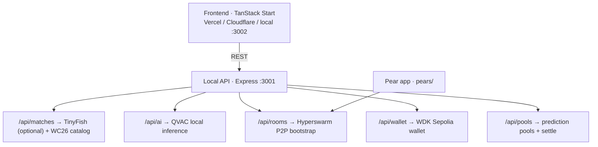

# KICKOFF

P2P football intelligence — **Pears + QVAC + WDK** for World Cup 2026 and beyond.  
Representing **Ghana 🇬🇭** · [Tether Developers Cup](https://dorahacks.io/hackathon/tether-developers-cup/detail)

## Tracks (all three)

| Track | Stack | Proof |
|-------|-------|-------|
| **Pears** | Hyperswarm P2P | `pears/` + `/api/rooms/*` — no central chat server |
| **QVAC** | `@qvac/sdk` 0.14.1 | `/api/ai/*` — on-device inference, WiFi-off demo |
| **WDK** | `@tetherto/wdk` | `/api/wallet/*` — self-custodial Sepolia wallet |

## Quick start (judges — under 5 minutes)

```bash
git clone https://github.com/henrysammarfo/kickoff
cd kickoff
cp .env.example .env
# Optional: add TINYFISH_API_KEY for live score ingestion (without it, WC26 catalog works offline)

# Terminal 1 — API (must start first, port 3001)
cd api && npm install && npm run dev

# Terminal 2 — frontend (port 3002)
cd .. && npm install && npm run dev
```

Verify (API must be running):

```bash
npm run api:smoke    # core stacks
npm run api:stress   # every endpoint
```

Open **http://localhost:3002** → Matches → join a QF room → **Analyze** (QVAC) → chat (P2P) → tip/pool (WDK).

**First QVAC run** downloads ~773MB model to `~/.qvac/models` (one-time).

## Proofs (copy-paste while API is running)

Judges can verify all three stacks from the terminal — no frontend required.

### QVAC — on-device inference

Model loads once at API boot (`[QVAC] Model loaded locally`). Confirm readiness:

```bash
curl -s http://127.0.0.1:3001/api/ai/status | jq
```

Expected (key fields):

```json
{
  "ready": true,
  "mode": "qvac-registry",
  "model": "LLAMA_3_2_1B_INST_Q4_0",
  "runningLocally": true,
  "noCloudDependency": true
}
```

Run a live analysis (France vs Morocco QF stats):

```bash
curl -s -X POST http://127.0.0.1:3001/api/ai/analyze \
  -H "Content-Type: application/json" \
  -d '{
    "homeTeam": "France",
    "awayTeam": "Morocco",
    "score": "0-0",
    "minute": 12,
    "homePossession": 58,
    "homeShots": 3,
    "awayShots": 1,
    "recentEvents": ["Yellow card 8'\''"]
  }' | jq
```

Expected (key fields — **this is the judged proof**):

```json
{
  "analysis": "France's midfield trio … limiting Morocco's creativity.",
  "prediction": "France will win 2-0 …",
  "confidence": 85,
  "processingTimeMs": 1800,
  "model": "LLAMA_3_2_1B_INST_Q4_0",
  "ranLocally": true,
  "deviceInference": true,
  "message": "Analysis generated locally — zero cloud, zero API calls"
}
```

**WiFi-off demo:** disconnect network, re-run the `curl` above — `ranLocally` stays `true`. QVAC never calls OpenAI, Venice, or Azure.

### WDK — Sepolia on-chain

```bash
curl -s http://127.0.0.1:3001/api/wallet/balance | jq
```

| Proof | Link |
|-------|------|
| Demo wallet | [0x64998cb8…e57d3 on Sepolia Etherscan](https://sepolia.etherscan.io/address/0x64998cb8F2c9a6A9293c47c24Bf4535E003e57d3) |
| USDt balance | ~100 USDt via [0xd077A400…e4fDb](https://sepolia.etherscan.io/token/0xd077A400968890Eacc75cdc901F0356c943e4fDb?a=0x64998cb8F2c9a6A9293c47c24Bf4535E003e57d3) |
| Live tip TX | [0xed0df152…02338e](https://sepolia.etherscan.io/tx/0xed0df1529a1bebbf5c7fbe22ec5e59dde30a63e7daa6510ab8b5bfcc8d02338e) (0.01 USDt) |

Send your own tip proof:

```bash
curl -s -X POST http://127.0.0.1:3001/api/wallet/tip \
  -H "Content-Type: application/json" \
  -d '{"recipientAddress":"0x70997970C51812dc3A010C7d01b50e0d17dc79C8","amountUsdt":0.01,"note":"KICKOFF proof"}' | jq
```

Returns `txHash` — paste into [Sepolia Etherscan](https://sepolia.etherscan.io/).

### Pears — Hyperswarm P2P room

```bash
curl -s -X POST http://127.0.0.1:3001/api/rooms/join \
  -H "Content-Type: application/json" \
  -d '{"matchName":"France-Morocco-QF"}' | jq
```

Expected: `"p2p": true`, `"topic": "<sha256 hash>"`, `"noServer": "Chat syncs over Hyperswarm P2P …"`

### WC26 fixtures (verified Jul 8 2026)

| Stage | Matches |
|-------|---------|
| **R16 finished** | Morocco 3-0 Canada · France 1-0 Paraguay · Norway 2-1 Brazil · England 3-2 Mexico · Spain 1-0 Portugal · Belgium 4-1 USA · Argentina 3-2 Egypt · Switzerland 0-0 Colombia (4-3 pens) |
| **QF upcoming** | France vs Morocco · Spain vs Belgium · Norway vs England · Argentina vs Switzerland |

Catalog lives in `api/data/fixtures-catalog.js` (12 matches). TinyFish may override scores when a QF is live.

### Pear standalone

```bash
cd pears && npm install
KICKOFF_MATCH=France-Morocco-QF node app.js
```

## Architecture



See [docs/ARCHITECTURE.md](./docs/ARCHITECTURE.md) (full Mermaid flows) and [docs/ROADMAP.md](./docs/ROADMAP.md).

## Live match data (TinyFish — optional)

**TinyFish ingests factual stats from the web. QVAC never calls the cloud for AI.**

```bash
TINYFISH_API_KEY=your_key   # server-side only — never commit
```

- `GET /api/matches/live` — merged WC26 catalog + live scores (60s cache)
- Without key: static fixtures load instantly (recommended for offline / fast demo)

Docs: https://docs.tinyfish.ai

## Download page / mobile / desktop

| What | Status |
|------|--------|
| **Marketing site** | Deploy frontend build (`npm run build`) to Vercel/Cloudflare |
| **Full app (QVAC+WDK+P2P)** | Runs **locally** — API + optional Pear CLI |
| **iOS / Android** | Roadmap: Pear runtime mobile shell (post-WC26) |
| **Windows / macOS / Linux** | `pear run .` from `pears/` after installing [Pear CLI](https://docs.pears.com) |

The `/download` page describes the Pear distribution model — not App Store binaries yet.

## Third-party services

| Service | Purpose | Required? |
|---------|---------|-----------|
| `@qvac/sdk` | Local AI | Yes |
| Hyperswarm / Pears | P2P | Yes |
| `@tetherto/wdk` | Wallet | Yes |
| TinyFish | Live score ingestion | Optional |
| Sepolia public RPC | Testnet | Yes (no key) |
| OpenAI / Venice / Azure | — | **Not used** for match AI |

## Docs

| Doc | Purpose |
|-----|---------|
| [docs/ARCHITECTURE.md](./docs/ARCHITECTURE.md) | System design + Mermaid flows |
| [docs/ROADMAP.md](./docs/ROADMAP.md) | Product phases beyond WC26 |
| [docs/SUBMISSION.md](./docs/SUBMISSION.md) | Hackathon checklist + demo script |
| [docs/KICKOFF_BUILD_GUIDE.md](./docs/KICKOFF_BUILD_GUIDE.md) | Team build bible |
| [docs/memory/](./docs/memory/) | Verified facts, API keys, strategy |

## License

MIT — see [LICENSE](./LICENSE)
