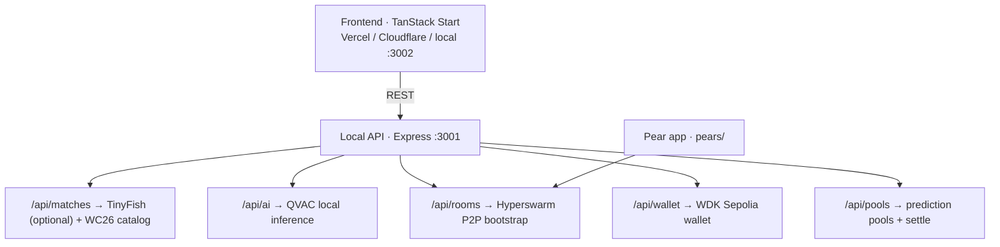

# KICKOFF

P2P football intelligence — **Pears + QVAC + WDK** for World Cup 2026 and beyond.  
Representing **Ghana 🇬🇭** · [Tether Developers Cup](https://dorahacks.io/hackathon/tether-developers-cup/detail)

## Tracks (all three)

| Track | Stack | Proof |
|-------|-------|-------|
| **Pears** | Hyperswarm P2P | `pears/` + `/api/rooms/*` — no central chat server |
| **QVAC** | `@qvac/sdk` 0.14.1 | `/api/ai/*` — on-device inference, WiFi-off demo |
| **WDK** | `@tetherto/wdk` | `/api/wallet/*` — self-custodial Sepolia wallet |

## Quick start (judges — under 5 minutes)

```bash
git clone https://github.com/henrysammarfo/kickoff
cd kickoff
cp .env.example .env
# Optional: add TINYFISH_API_KEY for live score ingestion (without it, WC26 catalog works offline)

# Terminal 1 — API (must start first, port 3001)
cd api && npm install && npm run dev

# Terminal 2 — frontend (port 3002)
cd .. && npm install && npm run dev
```

Verify (API must be running):

```bash
npm run api:smoke    # core stacks
npm run api:stress   # every endpoint
```

Open **http://localhost:3002** → Matches → join a QF room → **Analyze** (QVAC) → chat (P2P) → tip/pool (WDK).

**First QVAC run** downloads ~773MB model to `~/.qvac/models` (one-time).

## Proofs — live demo session (@henrysammarfo, Jul 8 2026)

**Your wallet, txs, and QVAC runs from the recorded demo.** Full write-up: [docs/proofs/DEMO-SESSION.md](./docs/proofs/DEMO-SESSION.md)

### WDK — your Sepolia transactions

| | |
|---|---|
| **Wallet** | [`0x64998cb8F2c9a6A9293c47c24Bf4535E003e57d3`](https://sepolia.etherscan.io/address/0x64998cb8F2c9a6A9293c47c24Bf4535E003e57d3) |
| **USDt** | 100 → **99.98 USDt** after demo (2 on-chain tips) |
| **Tip #1** · 0.01 USDt · 22:48 UTC | [`0xed0df152…02338e`](https://sepolia.etherscan.io/tx/0xed0df1529a1bebbf5c7fbe22ec5e59dde30a63e7daa6510ab8b5bfcc8d02338e) |
| **Tip #2** · 0.01 USDt · 22:52 UTC | [`0xfeffc5d3…11d738`](https://sepolia.etherscan.io/tx/0xfeffc5d336bd164e5e278840df7636b2a8b54318f48f7610ee2f93937711d738) |

### QVAC — analyses you ran in the demo

Every response: **`ranLocally: true`** · **`deviceInference: true`** · no cloud API

| Match | Room | Proof JSON |
|-------|------|------------|
| France vs Morocco QF | `/matches/mar-fra` | [qvac-france-morocco-qf.json](./docs/proofs/demo-session/qvac-france-morocco-qf.json) |
| Norway vs England QF | `/matches/nor-eng` | [qvac-norway-england-qf.json](./docs/proofs/demo-session/qvac-norway-england-qf.json) |
| France vs Paraguay R16 | `/matches/fra-par` | [qvac-france-paraguay-r16.json](./docs/proofs/demo-session/qvac-france-paraguay-r16.json) |

Example output (France vs Morocco, demo):

> *"France's dominance of possession is a concern, with Morocco's solidity in midfield forcing them back…"* — `ranLocally: true`, 3026ms, confidence 85%

### Pears — room you joined

France-Morocco-QF · topic `7176a8186ec2acd100e6022d511101934cb583a1a7a2ecb2c2711a3a2c288b48` · `p2p: true`

---

## Proofs (judges — reproduce locally)

Judges can re-verify all three stacks from the terminal — no frontend required.

**One command** — saves JSON proofs to `docs/proofs/`:

```bash
npm run api:proofs
```

Also run: `npm run api:smoke` (quick) · `npm run api:stress` (full suite)

### QVAC — on-device inference (judged proof)

On API boot you should see:

```
[QVAC] Download 100% (773.0/773.0 MB)
[QVAC] Model loaded locally | mode=qvac-registry | id=bd4db59fb4120b52
```

Model cache: `~/.qvac/models` · config: `qvac.config.json` · **no `httpUrl`** (not a cloud proxy).

**1. Confirm model is loaded locally**

```bash
curl -s http://127.0.0.1:3001/api/ai/status | jq
```

Live response (captured 2026-07-08):

```json
{
  "ready": true,
  "mode": "qvac-registry",
  "model": "LLAMA_3_2_1B_INST_Q4_0",
  "modelId": "bd4db59fb4120b52",
  "runningLocally": true,
  "noCloudDependency": true,
  "runtime": {
    "cacheDirectory": "/home/ubuntu/.qvac/models",
    "httpUrl": null
  }
}
```

**2. Run live match analysis** (France vs Morocco QF)

```bash
curl -s -X POST http://127.0.0.1:3001/api/ai/analyze \
  -H "Content-Type: application/json" \
  -d '{
    "homeTeam": "France",
    "awayTeam": "Morocco",
    "score": "0-0",
    "minute": 12,
    "homePossession": 58,
    "homeShots": 3,
    "awayShots": 1,
    "recentEvents": ["Yellow card 8'\''"]
  }' | jq
```

Live response — **look for `ranLocally: true`**:

```json
{
  "analysis": "France's defensive shape needs improvement after the yellow card, allowing Morocco to launch long-range attacks.",
  "prediction": "France will push for an equalizer in the 45' minute, but Morocco's cohesion will allow them to counter-attack.",
  "confidence": 60,
  "processingTimeMs": 1727,
  "model": "LLAMA_3_2_1B_INST_Q4_0",
  "ranLocally": true,
  "deviceInference": true,
  "message": "Analysis generated locally — zero cloud, zero API calls"
}
```

**3. Run outcome prediction** (Norway vs England QF)

```bash
curl -s -X POST http://127.0.0.1:3001/api/ai/predict \
  -H "Content-Type: application/json" \
  -d '{"homeTeam":"Norway","awayTeam":"England","context":"World Cup 2026 quarter-final"}' | jq
```

```json
{
  "prediction": "Norway vs England … Prediction: Norway 2-1 England …",
  "teams": { "home": "Norway", "away": "England" },
  "ranLocally": true,
  "mode": "qvac-registry"
}
```

**WiFi-off demo:** disconnect network → re-run step 2 → `ranLocally` stays `true`. No OpenAI, Venice, or Azure in the AI path.

Demo session JSON: [docs/proofs/demo-session/](./docs/proofs/demo-session/)

### WDK — Sepolia on-chain (reproduce)

```bash
curl -s -X POST http://127.0.0.1:3001/api/wallet/tip \
  -H "Content-Type: application/json" \
  -d '{"recipientAddress":"0x70997970C51812dc3A010C7d01b50e0d17dc79C8","amountUsdt":0.01,"note":"KICKOFF proof"}' | jq
```

Returns `txHash` → verify on [Sepolia Etherscan](https://sepolia.etherscan.io/).

### Pears — Hyperswarm P2P room

```bash
curl -s -X POST http://127.0.0.1:3001/api/rooms/join \
  -H "Content-Type: application/json" \
  -d '{"matchName":"France-Morocco-QF"}' | jq
```

Live response:

```json
{
  "matchName": "France-Morocco-QF",
  "topic": "7176a8186ec2acd100e6022d511101934cb583a1a7a2ecb2c2711a3a2c288b48",
  "p2p": true,
  "noServer": "Chat syncs over Hyperswarm P2P — this API only bootstraps the local peer."
}
```

### Full stack health

```bash
curl -s http://127.0.0.1:3001/api/health | jq '.status, .qvac, .wallet, .stacks'
```

Expected: `"ok"`, `true`, `true`, all three stacks listed.

See [docs/proofs/](./docs/proofs/) for latest captured JSON files.

### WC26 fixtures (verified Jul 8 2026)

| Stage | Matches |
|-------|---------|
| **R16 finished** | Morocco 3-0 Canada · France 1-0 Paraguay · Norway 2-1 Brazil · England 3-2 Mexico · Spain 1-0 Portugal · Belgium 4-1 USA · Argentina 3-2 Egypt · Switzerland 0-0 Colombia (4-3 pens) |
| **QF upcoming** | France vs Morocco · Spain vs Belgium · Norway vs England · Argentina vs Switzerland |

Catalog lives in `api/data/fixtures-catalog.js` (12 matches). TinyFish may override scores when a QF is live.

### Pear standalone

```bash
cd pears && npm install
KICKOFF_MATCH=France-Morocco-QF node app.js
```

## Architecture



See [docs/ARCHITECTURE.md](./docs/ARCHITECTURE.md) (full Mermaid flows) and [docs/ROADMAP.md](./docs/ROADMAP.md).

## Live match data (TinyFish — optional)

**TinyFish ingests factual stats from the web. QVAC never calls the cloud for AI.**

```bash
TINYFISH_API_KEY=your_key   # server-side only — never commit
```

- `GET /api/matches/live` — merged WC26 catalog + live scores (60s cache)
- Without key: static fixtures load instantly (recommended for offline / fast demo)

Docs: https://docs.tinyfish.ai

## Download page / mobile / desktop

| What | Status |
|------|--------|
| **Marketing site** | Deploy frontend build (`npm run build`) to Vercel/Cloudflare |
| **Full app (QVAC+WDK+P2P)** | Runs **locally** — API + optional Pear CLI |
| **iOS / Android** | Roadmap: Pear runtime mobile shell (post-WC26) |
| **Windows / macOS / Linux** | `pear run .` from `pears/` after installing [Pear CLI](https://docs.pears.com) |

The `/download` page describes the Pear distribution model — not App Store binaries yet.

## Third-party services

| Service | Purpose | Required? |
|---------|---------|-----------|
| `@qvac/sdk` | Local AI | Yes |
| Hyperswarm / Pears | P2P | Yes |
| `@tetherto/wdk` | Wallet | Yes |
| TinyFish | Live score ingestion | Optional |
| Sepolia public RPC | Testnet | Yes (no key) |
| OpenAI / Venice / Azure | — | **Not used** for match AI |

## Docs

| Doc | Purpose |
|-----|---------|
| [docs/ARCHITECTURE.md](./docs/ARCHITECTURE.md) | System design + Mermaid flows |
| [docs/ROADMAP.md](./docs/ROADMAP.md) | Product phases beyond WC26 |
| [docs/SUBMISSION.md](./docs/SUBMISSION.md) | Hackathon checklist + demo script |
| [docs/proofs/DEMO-SESSION.md](./docs/proofs/DEMO-SESSION.md) | **Author demo proofs** — txs + QVAC JSON |
| [docs/proofs/demo-session/](./docs/proofs/demo-session/) | Captured QVAC responses from live demo |
| [docs/KICKOFF_BUILD_GUIDE.md](./docs/KICKOFF_BUILD_GUIDE.md) | Team build bible |
| [docs/memory/](./docs/memory/) | Verified facts, API keys, strategy |

## License

MIT — see [LICENSE](./LICENSE)
