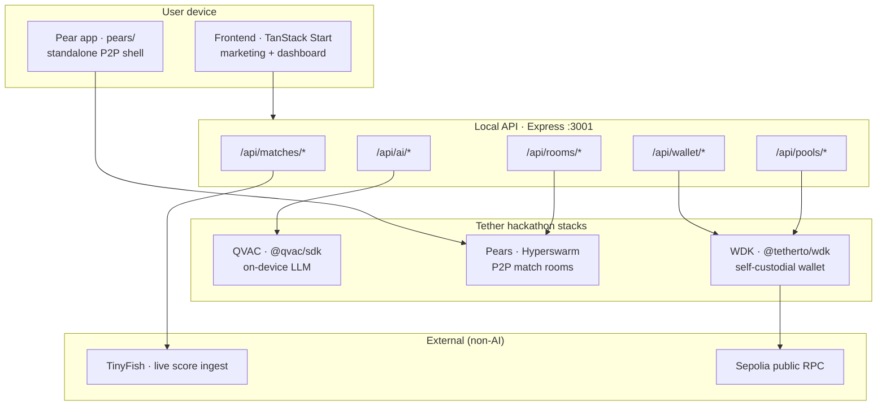
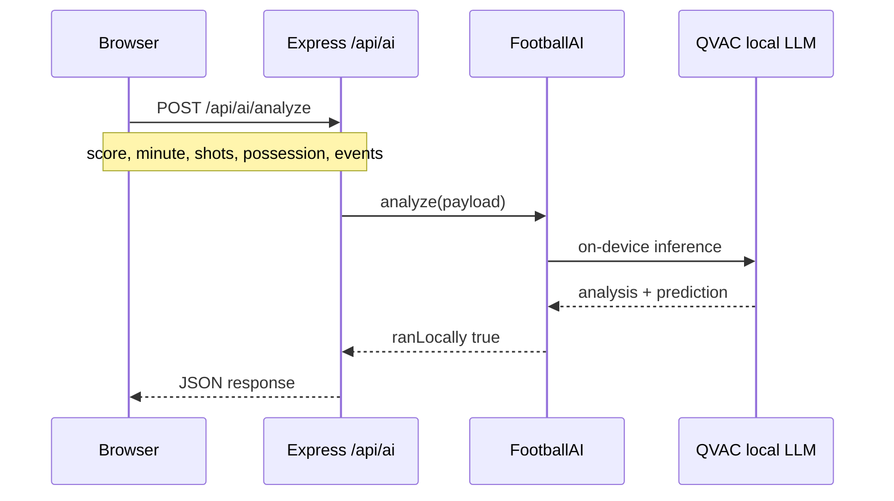
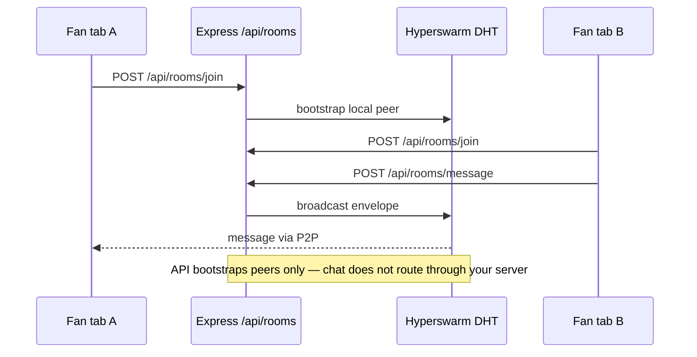
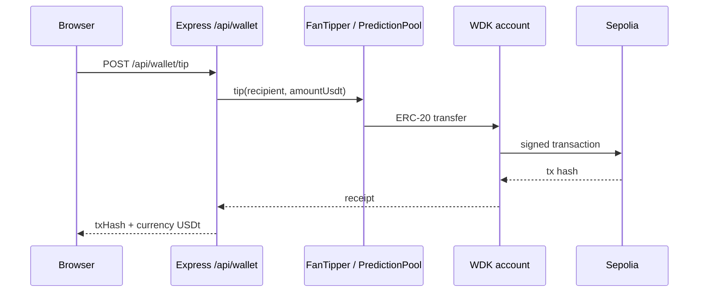
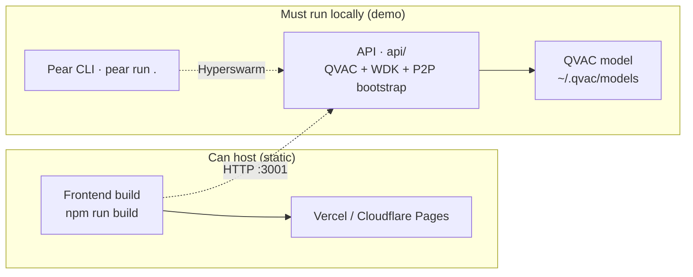

# Architecture

## Design principle

**Separate data ingestion from intelligence.**

| Layer | Technology | Cloud? |
|-------|------------|--------|
| Live stats | TinyFish (optional) | Yes — web fetch only |
| Match AI | QVAC `@qvac/sdk` | **No** — on-device |
| Fan chat | Hyperswarm / Pears | **No** — P2P DHT |
| Payments | WDK `@tetherto/wdk` | Chain RPC only |

QVAC supports MCP tool-calling for web search in **general** apps, but KICKOFF uses TinyFish for live football data to keep ingestion structured and QVAC analysis 100% local for judges.

## System overview



## Request flows

### Live score refresh

```mermaid
sequenceDiagram
  participant B as Browser
  participant API as LiveMatchesService
  participant TF as TinyFish
  participant Cat as WC26 catalog

  B->>API: GET /api/matches/live
  alt cache fresh (&lt; 60s)
    API-->>B: cached fixtures + scores
  else cache stale + API key set
    API->>TF: Search / Fetch / Agent
    TF-->>API: structured match JSON
    API->>Cat: merge into catalog
    API-->>B: live matches JSON
  else no API key
    API-->>B: static fixtures only
  end
```

### Match analysis (judged path)



### P2P chat



### WDK tip & pool settle



## Deployment



| Component | Where it runs |
|-----------|---------------|
| Frontend (`npm run build`) | Vercel, Cloudflare Pages, Nitro node-server |
| API (`api/`) | User's laptop (demo) — required for QVAC + WDK |
| Pear app (`pears/`) | User's machine via `pear run` |
| QVAC model | `~/.qvac/models` on user device |

**Why not full cloud deploy?** QVAC track requires on-device inference. The marketing frontend can be hosted; the intelligence stack runs locally beside the judge.

## Package versions (verified Jul 2026)

- `@qvac/sdk` **0.14.1** (latest)
- `@tetherto/wdk` **1.0.0-beta.13**
- `hyperswarm` **4.17.x**
