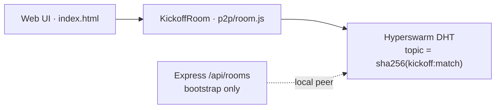

# KICKOFF Pear App

Standalone **Pears Stack** proof — Hyperswarm P2P match rooms.

## Run (Node — works everywhere)

```bash
npm install
KICKOFF_MATCH=France-Paraguay-R16 node app.js
```

## Run (Pear CLI — judges)

```bash
npm i -g pear
cd pears
pear run .
# or: pear run pear://kickoff  (after staging)
```

## GUI shell

Open `index.html` via Pear runtime for a minimal in-app log view (`ui.js`).

## Architecture



- **Building block:** Hyperswarm (topic = `sha256("kickoff:{matchName}")`)
- **No central server** for message sync
- Express API (`api/routes/rooms.js`) only bootstraps a local peer for the web UI

Docs: https://docs.pears.com/reference/#building-blocks
